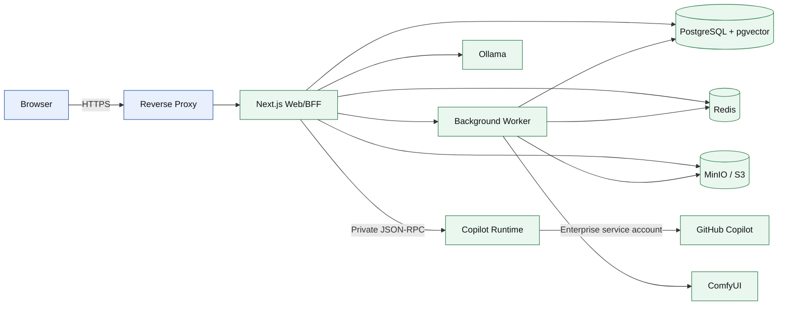
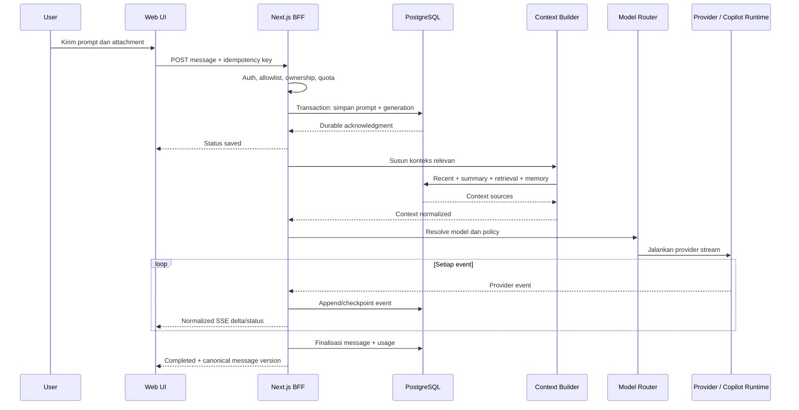
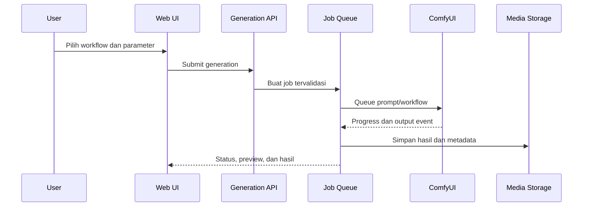

# zaltr.ai

> Satu ruang kerja AI untuk percakapan, coding, model lokal, dan generasi visual.

**Status:** perencanaan awal. Belum ada kode aplikasi atau keputusan teknis yang bersifat final.

## Ringkasan

zaltr.ai adalah aplikasi web dengan pengalaman percakapan yang familier, tetapi memiliki identitas visual sendiri. Pengguna dapat memilih model di samping kolom chat dan berpindah antara layanan GitHub yang didukung secara resmi, model lokal melalui Ollama, serta workflow gambar melalui ComfyUI.

## Infrastruktur (SUDAH JALAN, 2026-07-29)

Infrastruktur Docker terisolasi sudah dibuat dan berjalan — web app belum dibangun. Semua operasi lewat satu helper:

```bash
bin/zaltrctl init        # sekali: buat .env + secrets acak
bin/zaltrctl up          # start core: postgres+redis+minio+backup (tanpa port host)
bin/zaltrctl up-dev      # + port loopback 46432/46379/46900-1
bin/zaltrctl up ai       # + copilot-runtime (butuh secrets/copilot_github_token)
bin/zaltrctl up gpu      # + ollama milik zaltr (volume model sendiri)
bin/zaltrctl status      # kondisi container
bin/zaltrctl backup-now  # backup terenkripsi sekarang (otomatis tiap 03:05 WITA)
bin/zaltr-restore.sh ~/zaltr-backups/<arsip>.tar.enc          # drill restore
```

Isolasi dari proyek lain di server ini: project `zaltr`, network `zaltr-net`, volume `zaltr_*`, blok port dev 46xxx, backup di `~/zaltr-backups` (retensi 14 hari, AES-256, passphrase `secrets/backup.pass` — simpan salinannya di luar server).

## Web Preview (SUDAH JALAN, 2026-07-30)

Aplikasi web kini berjalan **permanen sebagai container** `zaltr-web` (Next.js standalone,
`restart: unless-stopped`, Docker enabled saat boot) — hidup 24/7 di server GPU tanpa
terminal/SSH: **http://localhost:46300** (atau IP server pada jaringan lokal).

```bash
bin/zaltrctl deploy-web          # migrasi DB + build image + start container web
bin/zaltrctl logs web            # ikuti log
sudo docker ps --filter name=zaltr-web
```

Untuk pengembangan (hot-reload), matikan container web dulu karena port sama:

```bash
sudo docker stop zaltr-web       # lepas port 46300
. ~/.nvm/nvm.sh && nvm use 22
npm run dev                      # selesai dev: bin/zaltrctl deploy-web lagi
```

Yang sudah berfungsi pada preview: sidebar (chat baru, cari, pin, trash), streaming NDJSON dengan tombol Stop, markdown + blok kode, **model picker di samping composer** (grup Zaltr demo / Copilot Enterprise / Ollama dengan status live), judul otomatis, dan persistensi write-first ke tabel `Conversation`/`Message`. Provider `zaltr-core` adalah demo internal untuk pratinjau UI; Copilot aktif setelah `secrets/copilot_github_token` diisi + profile `ai`, Ollama setelah `bin/zaltrctl up gpu`.

### Aktivasi Provider (semuanya sudah dikodekan — tinggal colok)

Lapisan provider di `src/server/providers/` sudah final (Copilot SDK resmi, Ollama,
ComfyUI, demo). Tidak ada kode yang perlu diubah saat mengaktifkan; cukup langkah ini:

**1. GitHub Copilot Enterprise (SDK resmi + CLI headless):**

```bash
# a. Isi token service account (gho_/ghu_/github_pat_) — satu baris, tanpa newline ganda:
printf '%s' 'TOKEN_DI_SINI' > secrets/copilot_github_token
# b. Nyalakan runtime + port dev loopback 46321:
bin/zaltrctl up-dev ai
# c. Restart web (npm run dev). Model picker otomatis menampilkan daftar model
#    live dari client.listModels(); chat streaming via sesi CLI per-conversation.
```

**2. Ollama (container zaltr sendiri, JANGAN pakai Ollama host 11434):**

```bash
bin/zaltrctl up-dev gpu
sudo docker exec zaltr-ollama ollama pull llama3.2   # atau model lain
# Model muncul otomatis di picker (live dari /api/tags).
```

**3. ComfyUI (server disediakan operator):**

```bash
# Isi endpoint di .env lalu restart web:
ZALTR_COMFYUI_URL=http://127.0.0.1:8188
# Picker menampilkan setiap checkpoint sebagai model "ComfyUI (gambar)".
# Hasil gambar dipersistenkan ke MinIO (bucket zaltr-files, ikut backup harian)
# dan dilayani via /api/files/... — chat berisi markdown gambar.
```

Semua URL provider dibaca dari env (`ZALTR_COPILOT_URL`, `ZALTR_OLLAMA_URL`,
`ZALTR_COMFYUI_URL`, `ZALTR_MINIO_URL`) sehingga topologi container nanti hanya
mengganti nilai env, bukan kode.

**4. Login Google (opsional, untuk akun pengguna):**

```bash
# Buat OAuth Client ID (Web) di console.cloud.google.com → Credentials.
# Authorized redirect URI: http://localhost:46300/api/auth/google/callback
# Lalu isi di .env dan restart web:
ZALTR_PUBLIC_URL=http://localhost:46300
ZALTR_GOOGLE_CLIENT_ID=xxxxxxxx.apps.googleusercontent.com
ZALTR_GOOGLE_CLIENT_SECRET=GOCSPX-...
```

Aturan akun: 1 akun Google = 1 akun zaltr (`googleId` unik); akun baru selalu
`pending` dan hanya **superadmin** yang bisa mengaktifkan; admin dapat mengubah
kredit user tetapi tidak kredit dirinya sendiri.


Produk ini dirancang sebagai **modular monolith**: sederhana untuk dibangun dan dijalankan pada tahap awal, tetapi setiap provider, tool, dan fitur tetap dipisahkan oleh kontrak yang jelas. Dengan pendekatan ini, fitur baru dapat ditambahkan tanpa mengubah inti aplikasi atau mengikat antarmuka ke satu penyedia AI.

## Nama Produk

- **Nama:** zaltr.ai
- **Wordmark:** ZALTR.AI
- **Nama folder/repository:** `zaltr-ai`
- **Domain utama yang diinginkan:** `zaltr.ai`
- **Asal nama:** gabungan suku kata pendek yang ringkas, mudah diingat, dan terdengar teknologis; `tr` dapat merepresentasikan transformer atau router; `.ai` menegaskan kategori produk.

> Ketersediaan domain pada saat perencanaan bukan jaminan kepemilikan. Domain dan merek perlu diamankan serta diperiksa kembali sebelum peluncuran publik.

## Visi

Menyediakan satu antarmuka yang dapat:

1. Mengakses model cloud dan model lokal dari tempat yang sama.
2. Menangani teks, kode, dokumen, gambar, dan workflow generatif.
3. Memberikan kontrol penuh atas model, privasi, biaya, dan penyimpanan data.
4. Diperluas dengan provider, model, tool, dan modality baru tanpa membangun ulang aplikasi.

## Sasaran Produk

- Pengalaman chat cepat, bersih, responsif, dan mendukung streaming.
- Pemilih model berada tepat di samping composer agar perpindahan model tidak mengganggu alur kerja.
- Ollama dan ComfyUI menjadi integrasi utama, bukan fitur tambahan kelas dua.
- Integrasi GitHub hanya menggunakan API, SDK, dan autentikasi resmi yang diizinkan.
- Local-first untuk data sensitif, dengan opsi self-hosted dan cloud pada tahap berikutnya.
- Desktop dan mobile memiliki fungsi inti yang setara.
- Arsitektur siap menerima provider dan fitur baru melalui registry serta capability contract.

## Prinsip Produk

1. **Provider-neutral**  
   Conversation, message, attachment, dan UI tidak boleh bergantung pada format satu provider.

2. **Capability-driven**  
   Model menyatakan kemampuan seperti `chat`, `vision`, `image`, `reasoning`, `tools`, atau `embedding`. UI hanya menampilkan kontrol yang didukung model tersebut.

3. **Local-first, cloud-optional**  
   Ollama dan ComfyUI dapat berjalan sepenuhnya di perangkat atau server milik pengguna.

4. **Progressive complexity**  
   Mulai sebagai modular monolith. Service terpisah hanya dibuat ketika beban atau batas proses benar-benar membutuhkannya.

5. **Secure by default**  
   Token tidak pernah dikirim ke browser jika dapat diproses di server. Log tidak boleh membocorkan prompt, file, cookie, atau credential.

6. **Original identity**  
   Pola interaksi boleh familier, tetapi kode, merek, aset, dan desain visual tidak menyalin produk lain secara identik.

## Jaminan Persistensi dan Memory

Persistensi chat dan memory adalah kontrak inti zaltr.ai, bukan fitur opsional. Implementasi dianggap gagal jika percakapan yang sudah tersimpan hilang karena logout, restart, pergantian model, update aplikasi, atau batas usia data.

### Aturan Non-negotiable

- Setiap message pengguna, respons model, tool call, citation, branch, dan attachment disimpan sebagai data kanonis.
- UI hanya menandai message sebagai tersimpan setelah server memberikan durable acknowledgment.
- Tidak ada TTL, auto-expire, auto-purge, atau penghapusan karena chat sudah lama maupun storage quota.
- Archive hanya menyembunyikan chat dari daftar utama.
- Trash adalah soft delete dan disimpan tanpa batas waktu sampai pengguna memilih hapus permanen.
- Edit prompt membuat branch baru; versi asli tetap tersimpan dan dapat dibuka kembali.
- Pergantian model atau provider tidak menghapus maupun mereset konteks percakapan.
- Attachment dan hasil generation yang dirujuk oleh chat ikut dipertahankan selama chat masih ada.
- Update schema menggunakan migration yang dapat diverifikasi dan memiliki backup/rollback plan.

### Memory yang Tetap Pintar

Context window setiap model tetap terbatas. Karena itu, mempertahankan kepintaran tidak dilakukan dengan mengirim seluruh database ke model pada setiap request. Sebuah **Context Builder** menyusun konteks secara dinamis dari:

1. Message terbaru dalam conversation.
2. Rolling summary yang memiliki versi dan sumber message.
3. Message lama yang relevan melalui semantic retrieval.
4. Memory eksplisit dari conversation, project, dan user.
5. File, citation, persona, serta instruction yang sedang aktif.

Message mentah tidak pernah dibuang setelah diringkas. Summary, embedding, dan memory hasil ekstraksi adalah data turunan yang dapat dibangun ulang dari sumber kanonis. Setiap memory menyimpan provenance agar pengguna dapat melihat chat sumber, mengoreksi isi, atau menonaktifkannya tanpa merusak riwayat asli.

Memory harus tetap tersedia lintas sesi, perangkat, model, dan provider. Jika model diganti dari Ollama ke provider GitHub atau sebaliknya, Context Builder tetap memberikan memory relevan dalam format yang didukung model tujuan.

### Dua Jalur Penghapusan Destruktif

Data hanya boleh dimusnahkan melalui dua aksi eksplisit:

1. **Hapus permanen chat**: satu chat, beberapa chat, atau semua chat dipilih dan dikonfirmasi untuk dihapus permanen.
2. **Hapus akun**: seluruh data milik akun dimusnahkan setelah re-authentication dan konfirmasi berlapis.

Logout, uninstall, archive, pindah folder, menghapus koneksi provider, atau menghapus model lokal tidak boleh menghapus chat dan memory.

Hapus permanen chat melakukan cascade terhadap message, branch, summary, embedding, citation cache, serta memory yang diturunkan hanya dari chat tersebut. Attachment atau asset bersama menggunakan reference counting dan baru dimusnahkan ketika tidak lagi dirujuk data lain. Aksi **hapus semua chat permanen** juga menghapus seluruh memory yang berasal dari percakapan, sehingga tidak ada fakta lama yang tetap memengaruhi jawaban.

Hapus akun mencakup conversation, project, file, memory, credential provider, workflow pribadi, generated asset, share link, dan data turunan lainnya. Sistem hanya boleh menyisakan tombstone audit minimum tanpa isi chat untuk mencegah job tertunda menghidupkan kembali data yang sudah dihapus.

### Ketahanan dan Pemulihan

- Penulisan message memakai transaction, stable ID, dan idempotency key agar retry tidak menggandakan atau menghilangkan data.
- Stream yang terputus menyimpan status parsial dan dapat dilanjutkan atau ditandai gagal tanpa kehilangan prompt.
- Sinkronisasi lintas perangkat menggunakan revision/version agar konflik tidak menimpa data diam-diam.
- Database memakai point-in-time recovery; object storage memakai versioning dan checksum.
- Backup dibuat otomatis, terenkripsi, dipantau, dan diuji melalui restore drill terjadwal.
- Envelope encryption memakai master key per user dan data-encryption key terpisah untuk chat/file/asset. Hard delete memusnahkan key resource terkait; hapus akun memusnahkan master key agar salinan dalam backup tidak dapat dibaca, lalu blok backup fisik dikeluarkan mengikuti siklus backup.
- Export lengkap tersedia sebelum pengguna menjalankan penghapusan permanen.

## Mode Penggunaan

### 1. Local Mode

Seluruh aplikasi, Ollama, dan ComfyUI berjalan pada komputer yang sama. Ini adalah target MVP dan cara termudah menjaga data tetap lokal.

### 2. Self-hosted Mode

zaltr.ai dijalankan pada server pribadi atau jaringan lokal. Ollama dan ComfyUI dapat berada pada host yang sama atau endpoint internal yang diizinkan.

### 3. Cloud + Local Connector

Aplikasi web berada di cloud, sedangkan connector lokal menjembatani Ollama dan ComfyUI di perangkat pengguna melalui koneksi keluar yang terenkripsi. Mode ini direncanakan setelah MVP.

> Browser atau server cloud tidak dapat begitu saja mengakses `localhost` milik pengguna. Karena itu, deployment cloud memerlukan local connector; membuka port Ollama atau ComfyUI langsung ke internet bukan solusi yang aman.

## Pengalaman Utama

### Tata Letak

- Sidebar kiri untuk chat baru, pencarian, riwayat, pinned chat, folder, dan project.
- Area utama untuk percakapan dan artifact.
- Composer persisten di bagian bawah.
- Tombol model di samping composer.
- Panel kanan opsional untuk sources, file, parameter model, workflow, dan detail generation.
- Command palette untuk navigasi dan tindakan cepat.

### Pemilih Model

Model picker harus mendukung:

- Pencarian model.
- `Auto` untuk memilih model berdasarkan capability, ketersediaan, biaya, dan preferensi.
- Model pinned/favorit.
- Pengelompokan berdasarkan provider: GitHub, Ollama, dan ComfyUI.
- Badge capability: teks, vision, image, tools, reasoning, embedding, dan context size.
- Status real-time: online, loading, unavailable, atau membutuhkan autentikasi.
- Informasi lokasi: local atau cloud.
- Estimasi biaya atau penanda gratis/local jika datanya tersedia.
- Pilihan model per chat dan override per message.
- Fallback model yang dapat dikonfigurasi.

### Composer

- Input multiline dengan auto-resize.
- Kirim, hentikan generation, dan ulangi.
- Drag-and-drop serta paste file/gambar.
- Attachment preview dan penghapusan sebelum dikirim.
- Pilihan model di samping kolom chat.
- Tombol tool dan modality berdasarkan capability model.
- Slash commands seperti `/image`, `/code`, `/search`, dan `/workflow`.
- Voice input sebagai fitur lanjutan.
- Indikator konteks dan estimasi token.

## Katalog Fitur

### A. Chat Inti

- Streaming respons token demi token.
- Markdown, tabel, LaTeX, syntax highlighting, dan diagram Mermaid.
- Copy seluruh jawaban atau satu blok kode.
- Edit prompt lalu buat cabang percakapan.
- Regenerate dengan model yang sama atau model berbeda.
- Continue generation dan retry saat koneksi gagal.
- Stop generation.
- Multi-turn context.
- Reasoning summary jika provider mendukung dan mengizinkannya.
- Feedback respons.
- Timestamp dan status message.
- Draft otomatis per conversation.
- Keyboard navigation yang aksesibel.
- Export chat ke Markdown, JSON, atau PDF.
- Import chat dari format yang didukung.
- Share link dengan kontrol publik, private, dan kedaluwarsa.

### B. Riwayat dan Organisasi

- New chat.
- Judul conversation otomatis dan manual.
- Search seluruh chat.
- Pinned chat.
- Folder dan tag.
- Auto-save setiap message, branch, draft, dan perubahan metadata.
- Archive tanpa menghapus data.
- Trash tanpa auto-purge, restore, dan permanent delete dengan konfirmasi.
- Riwayat versi saat prompt diedit atau respons dibuat ulang.
- Bulk actions.
- Project dengan instruction, file, memory, dan model default sendiri.
- Recent items dan continue where you left off.
- Sinkronisasi antarperangkat pada mode akun/cloud.

### C. GitHub Provider

- GitHub Copilot SDK resmi (`@github/copilot-sdk`) menjadi integrasi utama.
- Backend menggunakan dedicated Enterprise machine/service account; akun personal harian tidak dipakai sebagai credential layanan.
- Pengguna login ke zaltr.ai dan tidak perlu memiliki atau menghubungkan akun GitHub.
- Akses zaltr.ai bersifat invitation-only dan diperiksa melalui allowlist server-side.
- Semua request Copilot menggunakan pool AI Credits Enterprise milik operator. Saat keputusan dibuat, pool yang tersedia adalah 10.000.000 kredit dan nilainya harus dibaca dari dashboard/configuration, bukan di-hardcode ke aplikasi.
- Copilot runtime berjalan server-side dalam `mode: "empty"` dengan tool allowlist eksplisit.
- Token disimpan dalam secret manager, dienkripsi, dapat dirotasi, dan tidak pernah dikirim ke browser maupun log.
- Daftar model dibaca saat runtime berdasarkan akses service account dan kebijakan Enterprise.
- Chat dan streaming menggunakan SDK resmi; tidak menggunakan REST Copilot management API sebagai inference endpoint.
- Capability detection per model.
- Error yang jelas untuk credit, policy, region, token revoked, atau model unavailable.
- Setiap sesi memiliki owner zaltr.ai, ID yang dibuat server, namespace storage, rate limit, dan quota sendiri.
- Copilot Memory bawaan dinonaktifkan pada runtime bersama; memory kanonis tetap dikelola zaltr.ai agar tidak bocor lintas pengguna.
- GitHub MCP, shell, filesystem host, dan repository tools dinonaktifkan secara default.
- Repository context hanya melalui koneksi terpisah, scope minimum, allowlist, dan izin eksplisit pemilik repository.
- Ollama menjadi fallback ketika Copilot tidak tersedia atau batas operasional tercapai.
- Output kode dengan citation ke file lokal/repository jika tersedia.

> Pola service account didukung oleh dokumentasi backend Copilot SDK, tetapi perluasan menjadi akses publik atau layanan berbayar harus melewati review kebijakan dan kontrak GitHub. Scope saat ini tetap privat dan terbatas pada pengguna yang diizinkan operator.


### D. Ollama

- Konfigurasi satu atau beberapa endpoint Ollama.
- Deteksi endpoint dan health check.
- Sinkronisasi model dari server Ollama.
- Chat streaming.
- Vision untuk model yang mendukung gambar.
- Embedding untuk pencarian semantik/RAG.
- Model details: size, family, quantization, context, dan capabilities.
- Pull model dengan progress.
- Cancel pull, delete model, dan copy model name.
- Keep-alive dan unload model.
- Pengaturan temperature, top-p, top-k, seed, stop sequence, dan context window.
- Custom Modelfile pada tahap lanjutan.
- Endpoint allowlist agar aplikasi tidak menjadi SSRF proxy.

### E. ComfyUI

- Konfigurasi satu atau beberapa endpoint ComfyUI.
- Health check dan status queue.
- Upload workflow JSON.
- Validasi workflow sebelum execution.
- Template workflow yang dapat diberi nama, tag, dan versi.
- Mapping input workflow ke form yang mudah digunakan.
- Text-to-image, image-to-image, inpainting, upscaling, dan workflow custom.
- Pemilihan checkpoint, VAE, LoRA, sampler, scheduler, seed, steps, CFG, ukuran, dan batch.
- Queue job, cancel, retry, dan duplicate.
- Progress melalui WebSocket.
- Preview intermediate jika tersedia.
- Gallery hasil dengan metadata dan provenance workflow.
- Download hasil dan workflow yang digunakan.
- Reuse prompt/seed/settings.
- History persisten; asset yang dirujuk chat tidak boleh dibersihkan otomatis.
- Cleanup hanya untuk asset tanpa referensi dan harus dipicu atau disetujui pengguna.
- Pemisahan media generation dari message stream tanpa kehilangan konteks chat.

### F. Attachments dan Dokumen

- Gambar, PDF, teks, Markdown, CSV, dan source code.
- Validasi MIME type, signature, ukuran, dan jumlah file.
- Ekstraksi teks terstruktur.
- OCR opsional.
- Preview file.
- Chunking dan embedding untuk RAG.
- Citation dari jawaban ke sumber dan bagian dokumen.
- File library per user dan per project.
- Tidak ada auto-expiry untuk file yang masih dirujuk chat, project, atau memory.
- Reference counting, retention yang eksplisit, dan secure permanent deletion.
- Antivirus/malware scanning pada deployment multi-user.

### G. Search, RAG, dan Memory Persisten

- Pencarian percakapan full-text.
- Semantic search pada file dan chat.
- Knowledge base per project.
- Source citations yang dapat dibuka.
- Web search melalui provider/tool resmi.
- Memory per conversation, project, dan user.
- Context Builder menggabungkan recent messages, summary, retrieval, dan memory.
- Memory global/cross-chat hanya aktif setelah persetujuan pengguna.
- Provenance dari setiap memory ke message atau file sumber.
- Lihat, edit, pin, nonaktifkan, dan hapus memory.
- Summary dan embedding memiliki versi serta dapat dibangun ulang.
- Batas context serta strategi summarization/compaction tanpa menghapus message asli.
- Rekonsiliasi memory saat message sumber diedit atau dihapus permanen.
- Proteksi dasar terhadap prompt injection dari sumber eksternal.

### H. Tools dan Agent

- Tool registry dengan schema input/output.
- Tool calling hanya untuk model yang mendukung.
- Konfirmasi pengguna untuk aksi berisiko.
- Read-only dan write tool dibedakan dengan jelas.
- Timeout, retry, cancellation, dan audit log.
- Sandboxed code execution sebagai service terpisah pada fase lanjutan.
- MCP client pada fase lanjutan.
- Workflow agent yang dapat disimpan.
- Human-in-the-loop untuk setiap aksi eksternal penting.

### I. Multi-model dan Routing

- Bandingkan jawaban beberapa model berdampingan.
- Kirim ulang satu prompt ke model lain.
- Auto-router berbasis capability dan availability.
- Fallback chain saat model gagal.
- Batas biaya, latency, serta local-only preference.
- Model alias agar UI tidak bergantung pada identifier provider.
- Evaluasi manual dan benchmark prompt tersimpan.

### J. Prompt dan Persona

- System instruction per conversation.
- Prompt library.
- Prompt variables.
- Persona/assistant preset.
- Versioning dan duplicate preset.
- Default model serta tool per preset.
- Import/export preset.

### K. Artifact dan Workspace

- Canvas untuk dokumen atau kode yang dihasilkan.
- Version history.
- Diff antarversi.
- Preview Markdown, HTML, dan format aman lainnya.
- Download artifact.
- Artifact dapat direferensikan kembali oleh chat.
- Collaborative editing sebagai fitur jangka panjang.

### L. Akun dan Preferensi

- Mode single-user tanpa akun untuk local mode.
- Akun zaltr.ai invitation-only untuk deployment cloud/self-hosted.
- Undangan, allowlist, suspend/revoke access, dan session revocation dikelola operator.
- Login pengguna tidak menggunakan atau mengekspos identitas GitHub service account.
- Profile dan avatar.
- Tema terang, gelap, dan mengikuti sistem.
- Bahasa antarmuka Indonesia dan Inggris.
- Font size, density, dan accessibility settings.
- Default provider/model.
- Data export dan account deletion.
- Session management dan logout semua perangkat.

### M. Admin dan Observability

- Provider health dashboard.
- Queue dan job status.
- Model availability.
- Usage per provider/model/user.
- Latency, error rate, dan time-to-first-token.
- Budget dan quota.
- Rate limit.
- Audit log untuk perubahan konfigurasi serta tool execution.
- Structured logs dengan redaction.
- Optional telemetry yang transparan dan dapat dimatikan.
- Backup dan restore database.

### N. PWA dan Desktop

- Installable PWA.
- Offline shell dan draft lokal.
- Notification untuk job ComfyUI selesai.
- Desktop wrapper/local connector bila dibutuhkan.
- Deep link ke conversation/project.
- Auto-update untuk connector pada fase lanjutan.

## Arsitektur yang Diusulkan

### Stack Awal

- **Web/full-stack:** Next.js App Router + TypeScript.
- **UI:** Tailwind CSS dan komponen aksesibel dengan identitas visual zaltr.ai.
- **Streaming:** Web Streams/SSE; WebSocket untuk progress ComfyUI dan event real-time.
- **Database:** PostgreSQL + Prisma; `pgvector` untuk semantic retrieval.
- **Object storage:** filesystem pada development; MinIO/S3-compatible pada deployment bersama.
- **Queue dan koordinasi:** Redis + durable worker queue pada shared mode; status kanonis job tetap disimpan di PostgreSQL.
- **Authentication:** local single-user untuk development; akun zaltr.ai invitation-only dan allowlist wajib untuk deployment bersama.
- **Copilot runtime:** Node.js service + Copilot CLI headless pada private network; tidak dijalankan di Edge/serverless runtime.
- **Reverse proxy:** Caddy atau Nginx untuk TLS, request limits, dan routing internal.
- **Testing:** Vitest untuk unit/integration dan Playwright untuk end-to-end serta visual checks.
- **Packaging:** Docker Compose untuk aplikasi, database, dan service opsional.

Versi dependency akan dipilih dari rilis stabil saat implementasi, bukan dikunci dalam dokumen perencanaan ini.

### Frontend

Frontend tetap berada dalam repository Next.js yang sama, tetapi tidak memiliki akses langsung ke SDK provider, database, Redis, Ollama, atau ComfyUI.

**Tanggung jawab frontend:**

- App shell, sidebar, conversation view, composer, model picker, settings, gallery, dan admin view.
- Server Components untuk layout, initial conversation list, metadata, dan halaman yang tidak membutuhkan interaksi real-time.
- Client Components hanya untuk composer, streaming message, model picker, upload progress, dialog, dan panel interaktif.
- Mengonsumsi event internal zaltr.ai melalui HTTPS/SSE/WebSocket; tidak memahami format mentah Copilot, Ollama, atau ComfyUI.
- Menyimpan draft sementara di IndexedDB agar input belum terkirim bertahan saat tab tertutup.
- Menjadikan database server sebagai sumber kebenaran; cache browser tidak boleh menjadi satu-satunya salinan message.
- Reconnect menggunakan event cursor/last event ID, lalu mengambil ulang message kanonis dari backend.
- Desktop menggunakan sidebar dan panel kanan yang dapat diciutkan; mobile menggunakan drawer/sheet tanpa mengurangi fungsi inti.
- Route utama: `/chat/[conversationId]`, `/projects/[projectId]`, `/images`, `/library`, `/settings`, dan `/admin`.

**State frontend:**

- URL menyimpan conversation/project aktif.
- Server state berasal dari API dan dapat direvalidasi.
- Reducer lokal hanya menggabungkan stream delta sementara.
- Setelah event selesai atau reconnect, isi message direkonsiliasi dengan versi yang sudah tersimpan di server.
- Session cookie bersifat `HttpOnly`; token GitHub, Ollama, ComfyUI, dan object storage tidak pernah berada di JavaScript browser.

### Backend

Backend memakai pola **Backend for Frontend (BFF)** dan berjalan pada Node.js long-lived container. Untuk skala awal, semua business module tetap berada dalam modular monolith; hanya runtime AI dan worker yang dipisah sebagai proses karena lifecycle-nya berbeda.

#### 1. Web/BFF Next.js

- Authentication, invitation, allowlist, session cookie, CSRF, dan authorization.
- Conversation, project, file, settings, admin, dan export/delete API.
- Validasi request serta ownership setiap resource.
- SSE/Web Streams untuk chat dan WebSocket/SSE gateway untuk event job.
- Tidak pernah mengirim provider credential atau raw provider error ke browser.

#### 2. AI Orchestrator

- Provider registry dan capability normalization.
- Model picker data, auto-router, quota, budget, rate limit, dan Ollama fallback.
- Context Builder dari recent messages, summary, semantic retrieval, memory, file, dan instruction.
- Membuat opaque provider session ID yang dipetakan ke conversation dan owner zaltr.ai.
- Menormalisasi seluruh event provider sebelum disimpan atau dikirim ke frontend.

#### 3. Copilot Runtime

- Service privat yang menjalankan Copilot CLI dalam headless server mode dan diakses melalui `@github/copilot-sdk`.
- Dedicated Enterprise service-account token hanya tersedia pada proses ini melalui secret manager.
- Berjalan dengan `mode: "empty"`; tidak memiliki ambient shell, host filesystem, GitHub MCP, atau Copilot Memory.
- Hanya menerima koneksi dari backend melalui loopback/private Docker network dan connection token/mTLS jika melintasi host.
- Runtime session dapat dihentikan saat idle tanpa menghapus conversation kanonis di PostgreSQL.

#### 4. Background Worker

- Membuat summary berversi, embedding, memory projection, thumbnail, dan metadata file.
- Menjalankan serta memantau job ComfyUI, retry idempotent, dan reconciliation setelah restart.
- Menjalankan deletion graph, reference counting, export, backup verification, dan maintenance terjadwal.
- Tidak menghapus chat atau asset yang masih memiliki referensi.

#### 5. Data Services

- PostgreSQL menyimpan user, allowlist, conversation, message, memory, usage, job, audit metadata, dan deletion state.
- `pgvector` menyimpan embedding sebagai projection yang dapat dibangun ulang.
- Redis menangani queue delivery, distributed rate limit, lock, dan transient event fan-out; kehilangan Redis tidak boleh menghilangkan data kanonis.
- MinIO/S3 menyimpan attachment serta generated asset dengan object key acak, checksum, encryption, dan signed URL berumur pendek.

### Topologi Deployment



Hanya reverse proxy yang dibuka ke jaringan pengguna. PostgreSQL, Redis, MinIO, Copilot runtime, Ollama, dan ComfyUI tidak memiliki port publik.

### Kontrak API Awal

- `POST /api/conversations` membuat conversation.
- `GET /api/conversations/:id` mengambil snapshot kanonis.
- `POST /api/conversations/:id/messages` menyimpan prompt lalu memulai stream.
- `GET /api/conversations/:id/events?cursor=...` melanjutkan event setelah reconnect.
- `POST /api/generations` membuat job ComfyUI.
- `GET /api/generations/:id/events` mengikuti progress generation.
- `GET /api/models` mengembalikan model normalized sesuai policy dan availability.
- `POST /api/files` menginisialisasi upload tervalidasi.
- `POST /api/admin/invitations` membuat undangan pengguna.
- `POST /api/admin/users/:id/revoke` mencabut akses dan seluruh session aktif.

Semua mutation memakai schema validation, CSRF protection, ownership check, idempotency key, dan audit metadata. Nama route dapat berubah saat implementasi, tetapi batas kepercayaan dan urutan persistensinya tidak boleh berubah.

### Bentuk Modular Monolith

```text
zaltr-ai/
├── README.md
├── public/
├── prisma/
├── tests/
└── src/
    ├── app/                    # Routes, layouts, dan API surface
    ├── components/             # Komponen UI generik
    ├── features/
    │   ├── chat/
    │   ├── conversations/
    │   ├── projects/
    │   ├── files/
    │   ├── model-picker/
    │   ├── image-generation/
    │   └── settings/
    ├── server/
    │   ├── ai/
    │   │   ├── core/           # Kontrak provider, model, stream, capability
    │   │   ├── registry/       # Registrasi provider dan model
    │   │   ├── routing/        # Auto-select, fallback, policy
    │   │   └── providers/
    │   │       ├── github/
    │   │       ├── ollama/
    │   │       └── comfyui/
    │   ├── auth/
    │   ├── db/
    │   ├── files/
    │   ├── jobs/
    │   ├── tools/
    │   └── security/
    └── shared/                 # Types, schema, constants, utilities
```

Folder provider tidak boleh diimpor langsung oleh komponen UI. UI berbicara dengan service/use-case layer dan menerima model normalized.

### Kontrak Provider Konseptual

Setiap adapter mendaftarkan identitas, capability, health check, daftar model, dan operasi yang didukung.

```ts
type Capability =
  | "chat"
  | "vision"
  | "image"
  | "embedding"
  | "reasoning"
  | "tools";

interface ProviderAdapter {
  id: string;
  capabilities: Capability[];
  healthCheck(): Promise<ProviderHealth>;
  listModels(): Promise<ModelDescriptor[]>;
}
```

Operasi modality dibuat sebagai kontrak terpisah, misalnya `ChatProvider`, `EmbeddingProvider`, dan `ImageProvider`. Dengan demikian ComfyUI tidak dipaksa menyerupai LLM, sementara model picker tetap dapat menyajikan semuanya melalui descriptor yang konsisten.

### Alur Chat



Jika browser terputus, backend tetap menyimpan event yang sudah diterima. Saat tersambung kembali, frontend mengambil snapshot kanonis dan melanjutkan dari cursor terakhir; prompt tidak dikirim ulang tanpa idempotency key.

### Alur ComfyUI



## Model Data Awal

Entitas inti yang direncanakan:

- `User`
- `Session`
- `ProviderConnection`
- `ModelPreference`
- `Conversation`
- `ConversationBranch`
- `Message`
- `MessagePart`
- `ConversationSummary`
- `MemoryEntry`
- `MemorySource`
- `MessageEmbedding`
- `Attachment`
- `Project`
- `ProjectFile`
- `KnowledgeChunk`
- `PromptPreset`
- `WorkflowTemplate`
- `GenerationJob`
- `GeneratedAsset`
- `ToolDefinition`
- `ToolExecution`
- `UsageRecord`
- `AuditEvent`
- `DeletionRequest`
- `DeletionTombstone`

`Message` dan `MessagePart` adalah sumber kanonis yang tidak boleh digantikan oleh summary. `MessagePart` digunakan agar satu message dapat berisi teks, reasoning summary, image, file, citation, tool call, tool result, atau error tanpa menambah kolom khusus setiap kali modality baru muncul.

`ConversationSummary`, `MemoryEntry`, dan `MessageEmbedding` adalah projection turunan yang menyimpan versi serta referensi sumber. Projection dapat diregenerasi tanpa mengubah message asli. `DeletionRequest` mengorkestrasi hard delete yang idempotent, sedangkan `DeletionTombstone` hanya menyimpan identifier/hash minimum dan status penyelesaian tanpa konten pengguna.

## API dan Event Normalization

Semua provider diterjemahkan ke event internal yang stabil:

- `message.start`
- `content.delta`
- `reasoning.delta`
- `citation.added`
- `tool.requested`
- `tool.result`
- `asset.progress`
- `asset.completed`
- `usage.updated`
- `message.completed`
- `message.failed`

Raw response provider boleh disimpan hanya untuk debugging yang aman dan harus mengikuti retention serta redaction policy.

## Strategi Ekstensibilitas

### Menambahkan Provider Baru

1. Buat adapter di `src/server/ai/providers/<provider>`.
2. Implementasikan kontrak capability yang relevan.
3. Normalisasi model dan stream event.
4. Daftarkan adapter pada provider registry.
5. Tambahkan schema konfigurasi dan health check.
6. Tambahkan contract tests menggunakan fixture, bukan credential produksi.
7. UI model picker akan membaca descriptor tanpa perlu logika provider khusus.

### Menambahkan Fitur Baru

1. Buat modul di `src/features/<feature>`.
2. Definisikan use case dan schema input/output.
3. Gunakan core contract, jangan memanggil SDK provider dari UI.
4. Tambahkan migration hanya jika data baru benar-benar perlu disimpan.
5. Tambahkan permission, audit, error, loading, empty, dan cancellation states.
6. Tambahkan unit test dan minimal satu alur end-to-end untuk fitur berisiko tinggi.
7. Perbarui feature matrix dan dokumentasi konfigurasi.

### Feature Flags

Fitur eksperimental harus berada di belakang feature flag. Flag dapat berlaku global, per deployment, atau per user agar migrasi dan uji coba tidak mengganggu fitur stabil.

## Keamanan dan Privasi

- Credential disimpan di server dan dienkripsi at rest.
- Tidak menyimpan token pada `localStorage`.
- Cookie session menggunakan `HttpOnly`, `Secure`, dan kebijakan `SameSite` yang tepat.
- Endpoint Ollama/ComfyUI memakai allowlist protokol, host, dan port.
- Proteksi SSRF, CSRF, XSS, injection, path traversal, dan unsafe file upload.
- Validasi workflow ComfyUI dan parameter sebelum diteruskan.
- Rate limit per user, IP, provider, dan operation.
- Secret, authorization header, cookie, prompt sensitif, dan file content di-redact dari log.
- Tool berisiko memerlukan persetujuan eksplisit.
- Chat dan memory tidak memiliki TTL atau auto-purge.
- Archive dan trash tidak melakukan hard delete.
- Permanent delete dan account deletion memerlukan re-authentication, ringkasan dampak, serta konfirmasi berlapis.
- Permanent deletion melakukan cascade ke summary, embedding, citation cache, memory turunan, dan asset tanpa referensi.
- Encryption key per user mendukung crypto-shredding agar backup lama tidak dapat memulihkan data yang telah dimusnahkan.
- Pengguna dapat mengekspor seluruh data sebelum menghapus permanen.
- Backup terenkripsi, point-in-time recovery, checksum, dan prosedur restore diuji.
- Log operasional tidak menyimpan isi chat sehingga hard delete tidak meninggalkan salinan tersembunyi.
- Dependency scanning dan secret scanning pada CI.
- Content policy dan moderation dapat dikonfigurasi sesuai deployment/provider.

## Aksesibilitas

- Navigasi penuh dengan keyboard.
- Focus indicator yang jelas.
- Semantic HTML dan label pada seluruh control.
- Kontras memenuhi WCAG AA.
- Screen reader announcement untuk streaming, status, dan error.
- Reduce-motion preference.
- Target sentuh yang memadai pada mobile.
- Tidak mengandalkan warna saja untuk status provider/model.

## Performa dan Reliabilitas

- Penyimpanan kanonis diselesaikan sebelum UI menampilkan status `saved`.
- Autosave memakai debounce untuk draft, tetapi message terkirim menggunakan durable write langsung.
- Storage dipantau dengan low-space alert. Jika kapasitas habis, sistem menolak penulisan baru atau masuk mode read-only; riwayat lama tidak pernah dihapus otomatis untuk membebaskan ruang.
- Context Builder membatasi token berdasarkan relevance, bukan umur data; message lama tetap tersimpan.
- Summary dan embedding diproses asynchronous melalui job yang idempotent dan dapat diulang.
- Optimistic UI hanya untuk aksi yang aman.
- Cancellation diteruskan sampai provider/job jika didukung.
- Backpressure dan reconnect untuk stream.
- Timeout berbeda untuk chat, model pull, dan image generation.
- Retry hanya untuk operasi idempotent.
- Pagination/virtualization untuk riwayat dan model list yang panjang.
- Lazy loading untuk code highlighter, PDF preview, dan editor berat.
- Idempotency key untuk job generation.
- Provider circuit breaker dan fallback policy pada fase lanjutan.

## Pengujian

### Unit

- Provider normalization.
- Capability filtering.
- Model routing dan fallback.
- Allowlist, quota, dan session ownership policy.
- Tool deny-by-default pada Copilot runtime `mode: "empty"`.
- Validation schema.
- Permission dan security utilities.

### Integration

- Database repositories.
- API routes.
- Ollama adapter menggunakan mock server.
- ComfyUI queue/WebSocket menggunakan fixture.
- GitHub adapter menggunakan mocked official API/SDK.
- Copilot credit exhaustion, token revoked, dan fallback ke Ollama.
- Secret scanning memastikan token Enterprise tidak masuk response, log, trace, atau client bundle.

### End-to-end

- Membuat chat dan menerima stream.
- Menolak login atau request pengguna yang tidak berada dalam allowlist.
- Memastikan pengguna A tidak dapat membaca, melanjutkan, menghapus, atau mencari session pengguna B.
- Memastikan seluruh request Copilot melewati backend dan browser tidak pernah menerima credential GitHub.
- Memastikan shell, host filesystem, GitHub MCP, dan Copilot Memory tidak tersedia pada runtime bersama.
- Menerapkan quota/concurrency cap per pengguna tanpa memengaruhi session pengguna lain.
- Memuat kembali seluruh message setelah restart aplikasi dan database reconnect.
- Mengingat fakta relevan dari chat lama tanpa memasukkan seluruh riwayat ke context window.
- Mengganti model/provider tanpa kehilangan memory conversation.
- Memindahkan chat ke trash lalu memulihkannya dengan isi identik.
- Menjalankan permanent delete dan memverifikasi cascade ke summary, embedding, serta memory turunan.
- Menghapus akun dan memverifikasi credential, file, asset, serta encryption key tidak dapat dipulihkan.
- Mengganti model dari composer.
- Upload attachment.
- Menghentikan dan mengulang generation.
- Menjalankan workflow ComfyUI dan melihat progress.
- Menangani provider offline.
- Export/delete data.

### Visual dan Responsif

- Desktop, tablet, dan mobile.
- Light/dark theme.
- Composer dengan attachment panjang.
- Model picker dengan nama model terpanjang.
- Streaming respons panjang tanpa layout shift atau overlap.

## Tahapan Implementasi

### Fase 0 - Validasi Teknis

- Pastikan jalur integrasi GitHub yang resmi dan sesuai lisensi.
- Tentukan apakah target utama local-only, self-hosted, atau cloud.
- Uji koneksi Ollama dan ComfyUI dari lingkungan deployment target.
- Finalisasi stack, package manager, dan batas MVP.

### Fase 1 - Fondasi

- Scaffold Next.js + TypeScript.
- Design tokens dan app shell responsif.
- Database schema inti dengan canonical message store, branch, memory provenance, dan deletion workflow.
- Transactional write, stable ID, idempotency key, migration safety, serta encrypted backup.
- Provider registry, capability contract, dan normalized stream.
- Settings serta encrypted provider connection.
- Unit test dan CI dasar.

### Fase 2 - MVP Chat Lokal

- Conversation, message, branch, history, archive, trash, restore, dan search dasar.
- Autosave tanpa TTL, restart recovery, export, dan explicit permanent delete.
- Context Builder dasar: recent messages, rolling summary, retrieval chat lama, dan conversation memory.
- Composer lengkap dengan model picker.
- Copilot SDK dengan Enterprise service account sebagai provider utama.
- Runtime `mode: "empty"`, session ownership, tool deny-by-default, dan server-side streaming.
- Ollama discovery dan chat streaming.
- Fallback Copilot ke Ollama saat provider unavailable atau batas operasional tercapai.
- Markdown/code rendering, copy, edit, retry, regenerate, dan stop.
- Provider health/error states.
- Local single-user mode dan invitation-only shared mode.

### Fase 3 - Provider Hardening

- Model discovery dan capability mapping dari Copilot SDK.
- Credit monitoring, quota per pengguna, budget alert, dan circuit breaker.
- Token rotation, revoke drill, runtime health check, dan audit tanpa prompt content.
- Repository context melalui koneksi terpisah dan scope minimum jika dibutuhkan.
- Validasi fallback serta failover ke Ollama.

### Fase 4 - ComfyUI

- Endpoint configuration dan health check.
- Workflow template/import.
- Parameter form, job queue, WebSocket progress, dan cancel.
- Gallery, metadata, download, serta reuse settings.

### Fase 5 - Files, Projects, dan RAG

- Attachment pipeline.
- Project/folder/tag.
- File library dan citations.
- Embeddings serta semantic search lintas chat dan file.
- Memory user/project yang transparan, memiliki provenance, dan opt-in.
- Rebuild projection serta rekonsiliasi memory setelah edit/permanent delete.

### Fase 6 - Tools dan Advanced UX

- Tool registry dan approval flow.
- Multi-model comparison.
- Auto-router dan fallback.
- Prompt/persona library.
- Artifact workspace.
- MCP dan sandbox execution setelah security review.

### Fase 7 - Multi-user dan Production Hardening

- Authentication, invitation, allowlist, dan authorization multi-user terbatas.
- Object storage, Redis queue, rate limit, quota, dan audit.
- Point-in-time recovery, versioned object storage, restore drill, dan monitoring backup.
- Hard-delete orchestration, crypto-shredding, reference counting, dan deletion verification.
- PWA, notifications, serta local connector jika aplikasi di-host di cloud.
- Security review dan load test.

## Definisi MVP

MVP dianggap selesai ketika pengguna dapat:

1. Menjalankan zaltr.ai secara lokal atau sebagai pengguna yang telah diundang.
2. Menggunakan Copilot Enterprise tanpa menerima credential GitHub di browser.
3. Menghubungkan Ollama tanpa memasukkan credential ke browser.
4. Melihat model yang tersedia dan statusnya.
5. Memilih model dari tombol di samping composer.
6. Membuat, menghentikan, mengulang, dan melanjutkan chat streaming.
7. Melihat Markdown serta blok kode dengan benar.
8. Menutup atau me-restart aplikasi lalu menemukan seluruh chat tetap utuh.
9. Mendapat jawaban yang menggunakan memory relevan dari bagian lama conversation.
10. Mengganti model tanpa kehilangan konteks dan memory chat.
11. Mencari, mengganti nama, mengarsipkan, memindahkan ke trash, dan memulihkan conversation.
12. Menghapus permanen chat dengan konfirmasi dan memastikan memory turunannya ikut hilang.
13. Mengekspor data sebelum permanent delete atau account deletion.
14. Mendapat error yang jelas ketika provider offline.
15. Beralih otomatis ke Ollama ketika Copilot tidak tersedia.
16. Menolak pengguna yang tidak berada dalam allowlist.
17. Menggunakan UI desktop dan mobile tanpa overlap.
18. Menjalankan test suite dan build tanpa error.

GitHub Copilot SDK adalah bagian wajib MVP. ComfyUI tetap bagian inti roadmap, tetapi tidak harus memblokir MVP chat.

## Feature Matrix

| Area | MVP | Setelah MVP | Lanjutan |
| --- | --- | --- | --- |
| Chat streaming | Ya |  |  |
| Chat persisten tanpa TTL | Ya | Sinkronisasi lintas perangkat | Disaster recovery multi-region |
| Conversation memory | Dasar + provenance | Cross-chat/project memory | Personalized retrieval policy |
| Archive/trash/restore | Ya | Bulk operation | Organization retention controls |
| Permanent delete | Cascade terverifikasi | Crypto-shredding cloud | Compliance automation |
| Model picker | Ya |  |  |
| Ollama | Ya | Management lengkap | Multi-endpoint routing |
| GitHub provider | Copilot SDK + Enterprise service account | Credit/policy hardening | Repository-aware tools |
| ComfyUI |  | Workflow + gallery | Marketplace/template versioning |
| File upload | Dasar | RAG + citations | OCR dan knowledge automation |
| Projects |  | Ya | Collaboration |
| Multi-model compare |  | Ya | Automated evaluation |
| Tools/agent |  | Approval-based tools | MCP + sandbox |
| Local connector |  |  | Cloud-to-local bridge |
| Multi-user | Invitation-only | Self-hosted hardening | Team/organization controls |
| PWA/Desktop |  | PWA | Desktop companion |

## Risiko Utama dan Mitigasi

| Risiko | Mitigasi |
| --- | --- |
| Token Enterprise bocor atau dicabut | Secret manager, scope minimum, rotasi, revoke drill, redaction, dan Ollama fallback |
| Satu pengguna menghabiskan pool kredit | Quota per user, rate limit, concurrency cap, budget alert, dan model policy |
| Runtime bersama membocorkan konteks | `mode: "empty"`, owner check, session namespace, memory zaltr.ai, dan tool deny-by-default |
| Cloud app tidak dapat mengakses Ollama/ComfyUI pengguna | Prioritaskan local/self-hosted; bangun connector terenkripsi jika cloud diperlukan |
| Format provider berbeda-beda | Normalized model, message part, capability, dan stream event |
| ComfyUI workflow berubah atau memiliki custom nodes | Versioning, validation, schema mapping, dan compatibility warning |
| Fitur tumbuh menjadi kompleks | Modular monolith, feature flags, ownership per module, dan kontrak lintas modul |
| Message hilang saat crash atau koneksi putus | Durable acknowledgment, transaction, idempotency key, partial stream state, dan retry |
| Database atau storage rusak | Point-in-time recovery, object versioning, checksum, backup monitoring, dan restore drill |
| Chat panjang membuat model lupa | Context Builder dengan summary berversi, semantic retrieval, memory, serta provenance |
| Permanent delete menyisakan data turunan | Deletion graph, cascade job idempotent, reference counting, crypto-shredding, dan verification report |
| Prompt/file sensitif masuk log | Redaction default, opt-in diagnostics, dan retention policy |
| Tool calling menjalankan aksi berbahaya | Permission, allowlist, sandbox, confirmation, timeout, dan audit |
| Biaya cloud tidak terkendali | Usage record, budget, quota, model cost metadata, dan warning |
| UI menyerupai produk lain secara berlebihan | Gunakan pola interaksi umum tetapi desain, copy, aset, dan branding orisinal |

## Hal yang Tidak Dilakukan pada Tahap Awal

- Menyalin kode, aset, ikon, merek, atau tampilan ChatGPT secara identik.
- Menggunakan cookie, token editor, atau endpoint privat GitHub Copilot.
- Membagikan login atau token GitHub Enterprise kepada pengguna zaltr.ai.
- Menggunakan Copilot Memory global, ambient filesystem, shell, atau GitHub MCP pada runtime bersama.
- Membuka akses publik/berbayar sebelum review kebijakan dan kontrak GitHub.
- Membuka Ollama atau ComfyUI langsung ke internet tanpa autentikasi dan network controls.
- Melatih foundation model sendiri.
- Menjalankan kode hasil AI tanpa sandbox dan persetujuan.
- Memecah aplikasi menjadi banyak microservice sebelum ada kebutuhan nyata.
- Menambahkan collaboration/team billing sebelum alur single-user stabil.

## Keputusan yang Sudah Final

- GitHub Copilot SDK resmi menjadi provider utama.
- Dedicated Copilot Enterprise machine/service account membiayai request pengguna.
- Pengguna tidak login GitHub; mereka menggunakan akun zaltr.ai invitation-only.
- Pool Enterprise saat keputusan dibuat adalah 10.000.000 AI Credits.
- Runtime bersama memakai `mode: "empty"`, tool deny-by-default, dan memory milik zaltr.ai.
- Ollama menjadi fallback dan provider lokal.
- Scope rilis awal privat untuk beberapa pengguna yang diizinkan operator.

## Keputusan yang Harus Dibuat Sebelum Coding

- Target pertama: local-only, self-hosted, atau langsung cloud.
- Sistem operasi utama untuk local development dan deployment.
- Package manager: npm, pnpm, yarn, atau bun.
- Database local: PostgreSQL sejak awal atau SQLite untuk prototipe.
- Metode login zaltr.ai untuk pengguna undangan: passkey, magic link, atau credential lokal.
- URL dan kebijakan akses Ollama/ComfyUI.
- Format workflow ComfyUI pertama yang akan didukung.
- Bahasa UI default.
- Scope MVP yang disetujui dari feature matrix.

## Kriteria Fitur Baru

Sebuah fitur baru dianggap siap dirilis jika:

- Masalah pengguna dan acceptance criteria tertulis.
- Tidak menambah ketergantungan langsung UI ke provider tertentu.
- Memiliki loading, empty, success, error, retry, cancellation, dan permission states yang relevan.
- Aman untuk data sensitif dan tidak membocorkan credential.
- Responsif dan dapat digunakan dengan keyboard.
- Memiliki test sesuai risiko.
- Dapat dinonaktifkan melalui konfigurasi/feature flag jika masih eksperimental.
- Migration dan rollback strategy tersedia jika mengubah data.
- Dokumentasi konfigurasi dan feature matrix diperbarui.

## Langkah Berikutnya

1. Review dokumen ini dan tandai fitur yang masuk MVP.
2. Putuskan mode deployment pertama serta package manager.
3. Buat vertical slice Copilot SDK: service account, `listModels()`, streaming, dan `mode: "empty"`.
4. Catat endpoint dan model Ollama yang tersedia.
5. Pilih satu workflow ComfyUI sebagai vertical slice pertama.
6. Setelah keputusan tersebut final, scaffold aplikasi dan mulai dari provider contract + Ollama chat.

---

zaltr.ai akan dibangun sebagai produk yang dapat berkembang, bukan demo satu-provider. Setiap keputusan implementasi harus menjaga tiga jalur utama tetap setara: **cloud AI**, **local AI**, dan **visual generation**.
