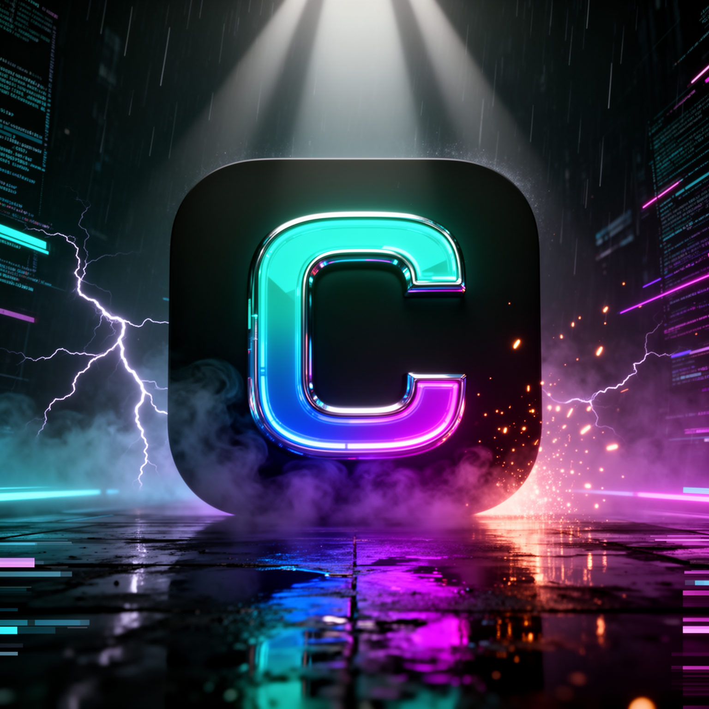
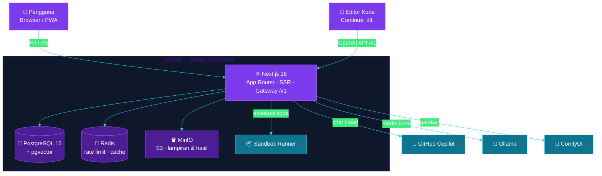

<!-- ══════════════════════════ HERO ══════════════════════════ -->
<div align="center">


<br />


<br /><br />

<a href="#-teknologi"></a>

<br /><br />

[](LICENSE)
&nbsp;
&nbsp;

[](https://github.com/muhammadrizalharis/zaltr-ai/commits)
[](https://github.com/muhammadrizalharis/zaltr-ai)
[](https://github.com/muhammadrizalharis/zaltr-ai)

<br />

### ✨ [Fitur](#-fitur-unggulan) &nbsp;•&nbsp; 🧩 [Arsitektur](#-arsitektur) &nbsp;•&nbsp; 🧰 [Teknologi](#-teknologi) &nbsp;•&nbsp; 🚀 [Mulai](#-mulai-cepat) &nbsp;•&nbsp; 🔧 [Konfigurasi](#-konfigurasi) &nbsp;•&nbsp; 🔌 [Provider](#-provider-ai) &nbsp;•&nbsp; 🔒 [Keamanan](#-keamanan) &nbsp;•&nbsp; 📄 [Lisensi](#-lisensi)

<br />



</div>


## 🎯 Satu Ruang Kerja, Semua Model AI

> _“Berhenti berpindah-pindah aplikasi. Chat, koding, riset, dan gambar — semua model terbaik dalam satu ruang kerja pribadimu.”_

**CALYZR.AI** adalah aplikasi web **self-hosted** yang menyatukan model **cloud** (GitHub Copilot Enterprise), model **lokal** (Ollama), dan **workflow generatif** (ComfyUI) dalam satu antarmuka chat yang cepat dan rapi. Dilengkapi *agent* yang **menjalankan kode sungguhan** di sandbox, basis pengetahuan (RAG), serta **gateway kompatibel OpenAI** yang bisa dipakai langsung dari editor kode.

Akses bersifat **khusus undangan** dan seluruh data disimpan sendiri — *local-first*, tanpa vendor eksternal.

<table>
<tr>
<td width="50%" valign="top">

### 💬 Chat Multi-Model
Streaming secepat kilat dengan tombol **Stop**, render markdown + blok kode, dan **pemilih model** tepat di samping composer — cloud, lokal, dan gambar dalam satu tempat.

</td>
<td width="50%" valign="top">

### 🤖 Agent Nyata
Bukan sekadar teks: menjalankan **Python/Shell** di sandbox, menulis & membaca berkas, mencari web, dan menghasilkan dokumen (DOCX/PDF) — hasilnya tersimpan otomatis.

</td>
</tr>
<tr>
<td width="50%" valign="top">

### 🎨 Media & Pengetahuan
**Vision** untuk analisis gambar, **generasi gambar** via ComfyUI, ekstraksi dokumen, dan **RAG** (`bge-m3` + `pgvector`) untuk menjawab dari sumbermu sendiri.

</td>
<td width="50%" valign="top">

### 🔌 Gateway OpenAI
Endpoint `/v1` (`chat/completions`, `responses`, `embeddings`) dengan **emulasi tool-calling** — colok ke **Continue** atau editor lain, langsung jalan.

</td>
</tr>
</table>


## ✨ Fitur Unggulan

<details open>
<summary><b>💬 Chat &amp; Model</b> — antarmuka yang cepat & rapi</summary>
<br />

| Fitur | Deskripsi |
|---|---|
| ⚡ **Streaming NDJSON** | Jawaban mengalir real-time dengan tombol **Stop**; render markdown + syntax highlight |
| 🎚️ **Model picker** | Pilih model di samping composer: Copilot Enterprise, Ollama lokal, ComfyUI (gambar), demo |
| 🗂️ **Sidebar rapi** | Chat baru, cari, pin, trash; judul percakapan otomatis |
| 🧠 **Memori & konteks** | Membaca lampiran & sumber bernama sepanjang percakapan dengan anggaran token |

</details>

<details>
<summary><b>🤖 Agent &amp; Tools</b> — menjalankan kode sungguhan</summary>
<br />

| Fitur | Deskripsi |
|---|---|
| 📦 **Sandbox runner** | Eksekusi **Python/Shell** terisolasi; hasil berkas dipersistenkan |
| 📝 **Baca/tulis berkas** | `tulis`, `baca`, `daftar` di workspace per-percakapan |
| 🌐 **Web & Drive** | Pencarian web dan pembacaan **Google Drive publik** langsung di chat |
| 📄 **Produksi dokumen** | Hasilkan DOCX/PDF/PPTX/gambar dari prompt dalam satu langkah |

</details>

<details>
<summary><b>🎨 Media, Dokumen &amp; Pengetahuan</b></summary>
<br />

| Fitur | Deskripsi |
|---|---|
| 👁️ **Vision** | Analisis gambar via model multimodal (`qwen2.5vl`) |
| 🖼️ **Generasi gambar** | ComfyUI → hasil tersimpan di object storage & tampil sebagai markdown gambar |
| 📚 **RAG / knowledge base** | Embedding `bge-m3` (1024-dim) + `pgvector` untuk jawaban dari sumbermu |
| 📎 **Ekstraksi lampiran** | Teks dari PDF dsb., dengan kuota upload & TTL berkas sementara |

</details>

<details>
<summary><b>🔌 Gateway, Billing &amp; Notifikasi</b></summary>
<br />

| Fitur | Deskripsi |
|---|---|
| 🧩 **Gateway OpenAI** | `/v1/chat/completions`, `/v1/responses`, `/v1/embeddings`, `/v1/models` + tool-calling |
| 💳 **Billing** | Paket kredit, masa aktif 30 hari, *gating* model, pengingat kedaluwarsa H-3 |
| 🔔 **Web Push** | Notifikasi push (VAPID) ke perangkat pengguna |
| 📧 **Email & Telegram** | Struk pembayaran via SMTP + notifikasi admin ke Telegram |

</details>

<details>
<summary><b>🛡️ Operasional &amp; Keamanan</b></summary>
<br />

| Fitur | Deskripsi |
|---|---|
| 🐳 **Isolasi Docker** | Project, network, dan volume terpisah penuh |
| 🔐 **Backup terenkripsi** | Backup harian **AES-256** dengan retensi |
| 🚦 **Rate limiting** | Berbasis Redis (atomic), fallback in-memory |
| 🧹 **Sanitasi input** | Pembersihan NUL & validasi di boundary API |

</details>


## 🧩 Arsitektur

Modular monolith yang bersih: satu bahasa (**TypeScript**) end-to-end, penyimpanan self-hosted, dan provider AI yang dapat ditukar hanya lewat variabel lingkungan.




## 🧰 Teknologi

<div align="center">

</div>

<br />

| Lapisan | Teknologi | Peran |
|---|---|---|
| **Frontend** | Next.js 16 (App Router, standalone) · React 19 · Tailwind CSS 4 | UI chat cepat, SSR, PWA |
| **Bahasa** | TypeScript 5 | Type-safe end-to-end |
| **Database** | Prisma 7 · PostgreSQL 16 + pgvector | Data relasional + vektor RAG |
| **Cache / Rate limit** | Redis | Throttle atomic & cache |
| **Object storage** | MinIO (S3-compatible) | Lampiran & hasil generasi |
| **Model AI** | GitHub Copilot SDK · Ollama · ComfyUI | Cloud, lokal, dan gambar |
| **Embedding / RAG** | `bge-m3` (1024-dim) | Basis pengetahuan |
| **Sandbox** | Runner Python/Shell | Eksekusi kode agent |
| **Notifikasi** | Web Push (VAPID) · SMTP · Telegram | Push, email, alert |
| **Deploy** | Docker · docker-compose · cloudflared | Reproducible & tunnel publik |
| **Kualitas** | Vitest · ESLint | Unit test & lint |


## 📂 Struktur Proyek

```
zaltr-ai/
├─ bin/               # zaltrctl & skrip operasi
├─ docker/            # Dockerfile runner/backup, dsb.
├─ prisma/            # schema + migrasi
├─ public/            # aset, ikon PWA, manifest
├─ src/
│  ├─ app/            # App Router: halaman, api/, v1/ (gateway), admin/
│  ├─ components/     # komponen UI React
│  ├─ lib/            # db, redis, storage
│  ├─ server/         # provider AI, agent, auth, billing, dll.
│  └─ generated/      # Prisma client (di-generate saat install)
├─ tests/             # unit test (Vitest)
├─ docker-compose.yml
└─ .env.example
```


## 🚀 Mulai Cepat

```bash
# 1) Klon & masuk folder
git clone <url-repo> zaltr-ai && cd zaltr-ai

# 2) Siapkan konfigurasi
cp .env.example .env          # lalu isi nilai rahasia (lihat "Konfigurasi")

# 3) Install dependency (otomatis menjalankan `prisma generate`)
npm install
```

<table>
<tr>
<td width="50%" valign="top">

### 🐳 Opsi A — Docker (disarankan)

```bash
bin/zaltrctl init        # generate .env + secrets acak
bin/zaltrctl up          # start layanan inti
bin/zaltrctl deploy-web  # migrasi DB + build + jalankan web
bin/zaltrctl status      # cek kondisi container
```

Aplikasi berjalan di **`http://localhost:46300`**
(ubah via `ZALTR_WEB_PORT`).

</td>
<td width="50%" valign="top">

### ⚡ Opsi B — Pengembangan

```bash
npm run dev              # hot-reload
```

Butuh Postgres/Redis/MinIO aktif — cara termudah:
`bin/zaltrctl up-dev` (port loopback), lalu
`npm run dev` di host.

</td>
</tr>
</table>


## 🔧 Konfigurasi

Seluruh konfigurasi dibaca dari variabel lingkungan berawalan `ZALTR_`. Salin `.env.example` menjadi `.env` lalu isi nilainya. **Variabel yang dibiarkan kosong menonaktifkan fitur terkait secara aman.**

| Kelompok | Variabel | Keterangan |
|---|---|---|
| 🗄️ Data | `ZALTR_POSTGRES_*` · `ZALTR_REDIS_*` · `ZALTR_MINIO_*` | Kredensial Postgres, Redis, MinIO |
| 🔑 Akses | `ZALTR_PUBLIC_URL` · `ZALTR_GOOGLE_CLIENT_ID/SECRET` | URL publik & login Google (OAuth) |
| 🤖 Provider | `ZALTR_OLLAMA_URL` · `ZALTR_COPILOT_URL` · `ZALTR_COMFYUI_URL` · `ZALTR_RUNNER_URL` | Endpoint model & sandbox |
| 🧠 Model | `ZALTR_FREE_MODEL` · `ZALTR_EMBED_MODEL` · `ZALTR_VISION_MODEL` | Model default per-fungsi |
| 📣 Integrasi | `ZALTR_VAPID_*` · `ZALTR_SMTP_*` · `ZALTR_TELEGRAM_*` | Web Push, email, notifikasi |
| 📏 Batas | `ZALTR_MAX_UPLOAD_MB` · `ZALTR_UPLOAD_QUOTA_GB` | Batas upload & konteks |

> 🔒 Rahasia sungguhan (`.env`, isi `secrets/`) **tidak pernah** di-commit — lihat `.gitignore`.


## 🔌 Provider AI

| Provider | Cara aktivasi |
|---|---|
| 🦙 **Ollama** | Jalankan Ollama, isi `ZALTR_OLLAMA_URL`, lalu `ollama pull <model>` — model muncul otomatis di pemilih |
| 🐙 **GitHub Copilot** | Isi token *service account* di `secrets/copilot_github_token`, aktifkan profile `ai` |
| 🎨 **ComfyUI** | Isi `ZALTR_COMFYUI_URL`; setiap checkpoint tampil sebagai model gambar |


## 📟 Perintah

| Perintah | Fungsi |
|---|---|
| `npm run dev` | Server pengembangan (hot-reload) |
| `npm run build` | Build produksi |
| `npm start` | Jalankan hasil build |
| `npm run lint` | ESLint |
| `npm test` | Unit test (Vitest) |
| `bin/zaltrctl <cmd>` | Orkestrasi Docker (`init` / `up` / `deploy-web` / `status` / `logs`) |


## 🔒 Keamanan

- 🏠 **Local-first** — data pengguna di Postgres/MinIO milik sendiri, tanpa vendor eksternal.
- 🙈 **Rahasia terpisah** — `.env` & folder `secrets/` **tidak** di-commit.
- 🔐 **Backup AES-256** harian dengan retensi.
- 🚦 **Rate limiting** & sanitasi input pada boundary API.


## 📄 Lisensi

<div align="center">

**Proprietary — Hak Cipta Dilindungi (All Rights Reserved)**
© 2026 **Developer CALYZR.AI RZL**

</div>

Kode ini ditampilkan publik **hanya** untuk referensi/transparansi — **bukan** open-source. Dilarang menggunakan, menyalin, memodifikasi, atau mendistribusikan tanpa izin tertulis. Selengkapnya di berkas **[LICENSE](LICENSE)**.

<div align="center">


<sub>Dibuat dengan 💜 oleh <b>Developer CALYZR.AI RZL</b></sub>

</div>
